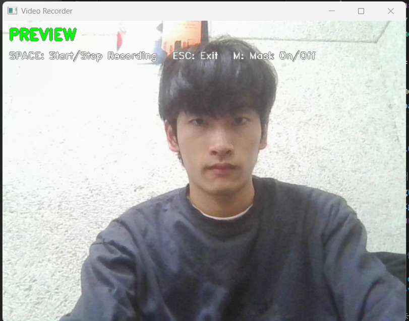
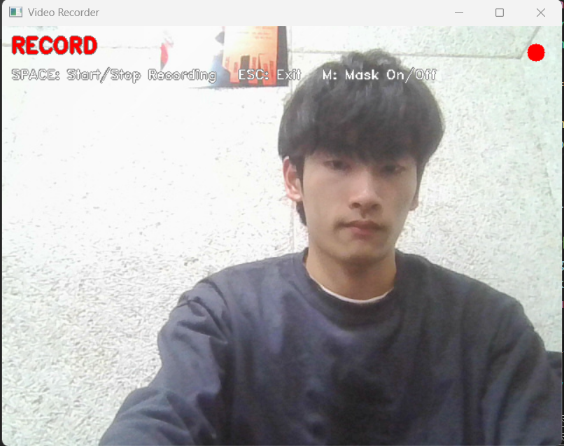
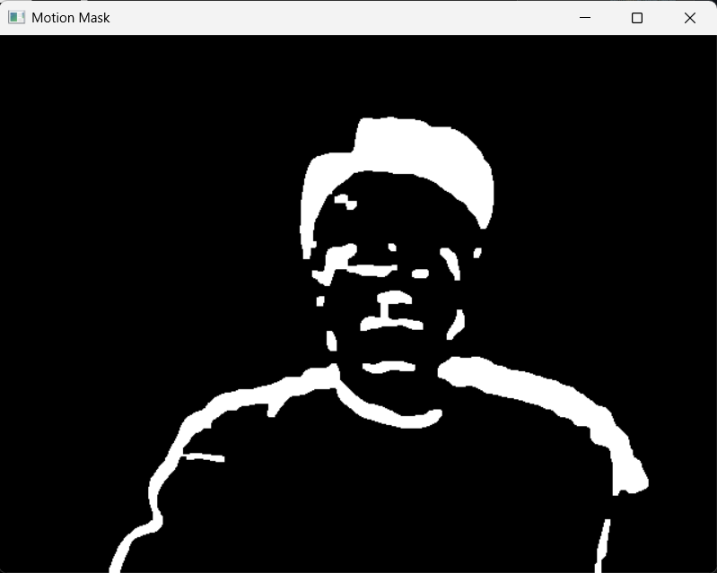

# 🎥 Video Recorder with Motion Detection

## Overview
This project is a simple video recorder built with OpenCV.  
It captures real-time webcam input, supports recording functionality, and visualizes moving objects using a background subtraction-based approach.

---

## Features

### Video Recording
- Real-time webcam streaming
- Toggle between Preview and Record modes
- Save recorded video to file
- Automatic filename generation based on timestamp

### Motion Detection
- Detects moving objects using background subtraction
- Computes frame differences against a dynamic background model
- Applies thresholding to extract motion regions
- Displays bounding boxes around detected objects in real time

---

## Controls

| Key | Action |
|-----|--------|
| SPACE | Start / Stop recording |
| ESC | Exit program |
| M | Toggle motion mask display |

---

## Limitations

The motion detection in this project is based on a simple background subtraction method, which has inherent limitations:

- Sensitive to lighting changes and camera noise
- Large or slowly moving objects may be partially detected
- Objects with colors similar to the background may not be clearly distinguished
- Static objects can gradually be incorporated into the background model
- This method detects motion only and does not perform high-level tracking (e.g., pose estimation or object recognition)

---

## Screenshots

### Preview Mode


### Record Mode


### Motion Mask Visualization


---

## Demo

YouTube Demo:  
https://youtu.be/MmohSZivIHQ

---

## Installation

```bash
pip install opencv-python numpy
